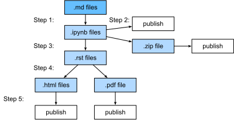

# 构建管道

源文件是一些 markdown 文件。它们要么是纯粹的 markdown 文件，要么是以 markdown 格式保存、但已删除输出的 juypyter 笔记本。对于后者，我们可以直接使用 Jupyter 运行 `notedown` 插件来打开并编辑它们，然后在提交前运行 “Kernel -> Restart & Clear Output” 以清除输出。

然后我们的构建管道会运行以下步骤来构建结果。

1. 将 .md 文件转换为 .ipynb 文件并评估每个文件。我们使用 .md 文件作为源格式的原因是因为它很容易查看源文件的更改情况。我们每次都进行评估的原因是保证每个笔记本都是可执行的。这个评估步骤可能很耗时，我们可以
   - 假设每个 notebook 可以在 10 分钟内执行，我们可以使用多个 GPU 来加速执行。
   - 如果源.md文件在上次评估后没有变化，我们可以重新使用缓存的.ipynb文件，以避免再次执行。
   -我们使用多个进程并行运行 notebook 。
1. 带有输出的 .ipynb 文件可以直接上传到 Github，因此用户可以克隆它以在本地或云端运行它们。我们还压缩所有文件，以便用户可以轻松下载。
1. 然后将这些 .ipynb 文件转换为格式与 Sphinx 兼容的 .rst 文件。额外的预处理步骤用于图像/表格/引文参考。
1. 使用 Sphinx 构建 .html 和 .pdf 文件
1. 在线发布所有 .html/.pdf/.zip 文件，例如发布到 AWS S3 存储桶中。

## 多种实现方案

