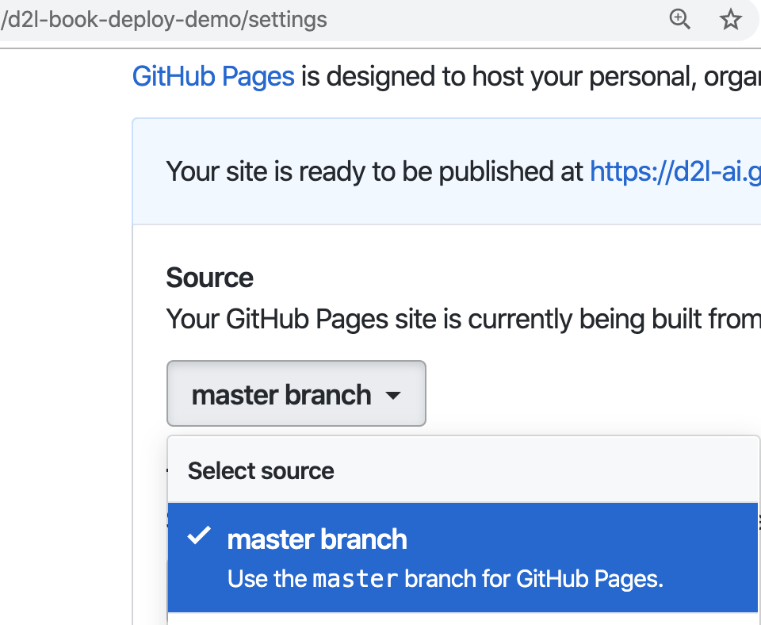
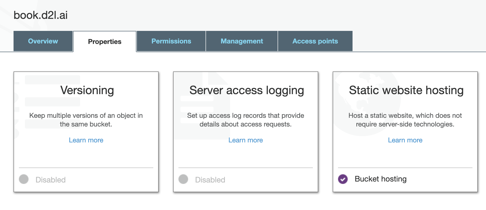

# 部署

您可以将构建的结果复制到您喜欢的、可以在线展示内容的任何地方。除此之外，`d2lbook` 提供了两种部署构建结果的方法：通过 [Github](http://github.com/) 或通过 [AWS](https://aws.amazon.com/) 部署。

## 通过 Github 部署

[Github Pages](https://pages.github.com/) 允许我们通过 Github repo 托管一个网站。为此，我们首先需要创建一个 github repo，例如我们创建了 [d2l-ai/d2l-book-deploy-demo](https://github.com/d2l-ai/d2l-book-deploy-demo ) 来作为例子。然后在 `Settings -> GitHub Pages` 中从 master 分支启用服务。您将获得一个 URL 来访问它。此示例为 [d2l-ai.github.io/d2l-book-deploy-demo](https://d2l-ai.github.io/d2l-book-deploy-demo/)。您可以向 `README.md` 添加任何内容，但这些内容不会显示在网站上。


:width:`400px`

现在让我们创建一个指定了 `[deploy] github_repo` 的项目并构建 HTML 和 PDF。多亏了 LaTeX，你会看到大量的日志信息，更准确地说，是 LaTex 的排版引擎 `xelatex`。

```{.python .input}
!mkdir -p deploy
```

```{.python .input}
%%writefile deploy/index.md
# 部署 d2lbook 的 demo

这是一个部署在 Github 上的 demo 。

````toc
get_started
````
```

```{.python .input}
%%writefile deploy/get_started.md
# 开始

首先请安装我最喜欢的包 `numpy`.
```

```{.python .input}
%%writefile deploy/config.ini
[project]
name = deply-demo

[html]
header_links = PDF, https://https://d2l-ai.github.io/d2l-book-deploy-demo/deply-demo.pdf, fas fa-file-pdf

[deploy]
github_repo = d2l-ai/d2l-book-deploy-demo
```

```{.python .input}
!cd deploy; d2lbook build html pdf
```

要部署到 Github，您需要将机器的 [SSH 密钥导入到 Github](https://github.com/settings/keys)。否则，您可能需要输入您的帐户和密码。完成后，您可以在一两分钟内在线评估结果。对于该示例，URL 为 [/d2l-ai.github.io/d2l-book-deploy-demo/](https://d2l-ai.github.io/d2l-book-deploy-demo/)。

```{.python .input}
!cd deploy; d2lbook deploy html pdf
```

最后，让我们清理一下我们的工作区。

```{.python .input}
!rm -rf deploy
```

## 通过 AWS 部署
 
另一个受支持的选项是通过 AWS 部署。这个选项提供了更大的灵活性，但需要您了解 AWS 的基本用法。

我们推荐以下部署过程：

1. 将结果复制到 [S3](https://aws.amazon.com/s3/).
2. 通过使用 [CloudFront](https://aws.amazon.com/cloudfront/) 与 [CDN](https://en.wikipedia.org/wiki/Content_delivery_network) 服务以减少延迟。
3. 在 [Route 53](https://aws.amazon.com/route53/) 购买并添加定制域名。

现在让我们一个接一个地走过这三个步骤。在开始之前，您需要拥有一个有效的AWS帐户，并通过运行 `aws configure` 输入 [AWS访问密钥](https://docs.aws.amazon.com/IAM/latest/UserGuide/id_credentials_access-keys.html) （`AWS access key`）。


首先，创建一个 S3 存储桶。您可以使用目标域名作为您的存储桶名称。举个例子，加入这个站点部署在 book.d2l.ai ，那么我们把创建的这个存储桶命名为 `book.d2l.ai` 。此外，我们需要在创建此存储桶时禁用通过 ACL 阻止公共访问（disable blocking public access through ACLs），请参阅 :numref:`fig_s3-acl` 并启用静态网站托管，请参阅 :numref:`fig_s3-web-hosting` 。然后您将获得一个 URL 来访问此存储桶。在我们的示例中，它是 http://book.d2l.ai.s3-website-us-west-2.amazonaws.com/ 。


:label:`fig_s3-acl`
:width:`500px`



:label:`fig_s3-web-hosting`
:width:`500px`

第二步，通过指定以下选项，创建一个新的 CloudFront 发行版：
- 源域名：之前的 S3 URL，不带 `http://` ， 例如 `book.d2l.ai.s3-website-us-west-2.amazonaws.com`
- 默认根对象： `index.html`
- [optional] 待用域名 （CNAMEs）： 您的目标域名，例如 `book.d2l.ai`
- [optional] SSL 证书：您可以在 [证书管理器](https://aws.amazon.com/certificate-manager/) 中创建一个，然后选择使用它。

几分钟后，我们将获得诸如 `d1y0wi2ibwmzrt.cloudfront.net` 之类的域名。

第三步，您可以在 Route 53 购买域或将 Route 53 的 DNS 添加到现有域中。之后，创建一个“托管区域”，然后创建一个以 CoundFront 域名为别名目标的 Type-A 记录集，示例参见 :numref:`fig_record-set` 。


:label:`fig_record-set`
:width:`350px`

当您完成后，在 `config.ini` 的以下条目中指定您的 S3 存储桶名称。

```bash
[deploy]
s3_bucket = s3://book.d2l.ai
```

每次运行 `d2lbook deploy` 时，所有结果都会同步到此存储桶并自动部署。请注意，由于我们启用了 CDN，任何新的更改都可能需要一段时间才能显示在您的 URL 中（例如 http://book.d2l.ai）。但是您可以检查 S3 存储桶 URL（例如 http://book.d2l.ai.s3-website-us-west-2.amazonaws.com）以便立即查看更改。
