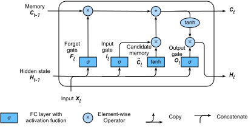

# Markdown 单元格
:label:`sec_markdown`


`d2lbook` 提供了超出 Jupyter 中普通 markdown 支持的附加功能。

## 目录

您可以使用 `toc` 代码块来指定目录。这里 `:maxdepth: 2` 表示显示两级目录，`:numbered:` 表示在每个部分前添加编号（默认不启用）。另外请注意，您不需要指定文件扩展名。

`````
```toc
:maxdepth: 2
:numbered:

guide/index
```
`````


## 图片


我们可以将图片标题放在 `[]` 块中。此外，我们可以使用 `:width:` 后跟一个值用于在内联块中指定图像宽度，类似地使用 `:height:` 表示高度。

```

:width:`400px`
```


:width:`400px`


### SVG 图像


我们建议您尽可能多地使用 SVG 图像。它的图像边缘锐利，而且尺寸很小。但是由于 Latex 不支持 SVG 图像，如果要构建 PDF 输出，则需要安装 `rsvg-convert`。在 Macos 上，您可以简单地运行命令 `brew install librsvg` ；对于 Ubuntu，您可以运行 `sudo apt-get install librsvg2-bin`。



## 表格

您可以在表格前插入表格标题，方法是以 `:` 开头。请注意，您需要在标题和表格本身之间留下一条空行。

```
: The number is computed by $z_{ij} = \sum_{k}x_{ik}y_{kj}$.

| Year | Number | Comment |
| ---  | --- | --- |
| 2018 | 100 | Good year |
| 2019 | 200 | Even better, add something to make this column wider |
```


: The number is computed by $z_{ij} = \sum_{k}x_{ik}y_{kj}$.

| Year | Number | Comment |
| ---  | --- | --- |
| 2018 | 100 | Good year |
| 2019 | 200 | Even better, add something to make this column wider  |

如果表格标题编号显示不正确，您可能需要将 `pandoc` 更新到最新版本。

## 交叉引用

我们经常想在书中引用章节、图片、表格和方程式。

### 引用章节
:label:`my_sec3`

我们可以在章节标题后放置一个标签，以允许该章节被这个标签引用。标签的格式是在一个内嵌的代码块中使用 `:label:` 跟上其标签名称。

```
### Referencing Sections
:label:`my_sec3`
```


然后我们可以通过在内联代码块中的使用 `:ref:` 后跟该标签的名称，来引用该部分

```
:ref:`my_sec3` 演示如何引用章节
```

:ref:`my_sec3` 演示如何引用章节


请注意，它会显示出引用部分的标题，并带有可单击的链接。我们还可以通过将 `:num:` 更改为 `:numref:` 来使用带编号的版本，例如 :numref:`my_sec3`。

如果标签不正确，比如我们把 `my_sec2` 放在这里，构建日志里将出现 `warning` ，例如

```
WARNING: undefined label: my_sec2
```

您可以通过在 `config.ini` 中设置 `warning_is_error = True` 将这个 `warning` 改为 `error` 。

此外，我们也可以从其他文件交叉引用标签，例如 :numref:`sec_code` 。这也适用于图片、表格和方程式。


### 引用图片

类似地，我们可以给一个图片加上标签，并在以后引用它。

```

:width:`300px`
:label:`img_catdog`

我们可以看看 :numref:`img_catdog` ，这里面是一只猫和一只狗。
```


:width:`300px`
:label:`img_catdog`

我们可以看看 :numref:`img_catdog` ，这里面是一只猫和一只狗。

### 引用表格

```
:这是一个很长的表格标题。它将分成几行。并且还包含一个数学方程式。 $z_{ij} = \sum_{k}x_{ik}y_{kj}$.

| Year | Number | Comment |
| ---  | --- | --- |
| 2018 | 100 | Good year |
:label:`table`

Refer to :numref:`table`

```


:这是一个很长的表格标题。它将分成几行。并且还包含一个数学方程式。 $z_{ij} = \sum_{k}x_{ik}y_{kj}$.

| Year | Number | Comment |
| ---  | --- | --- |
| 2018 | 100 | Good year |
:label:`table`

Refer to :numref:`table`

### 引用方程式

这里的区别是我们需要使用 `eqlabel` 而不是 `label`。例如：

```
$$\hat{\mathbf{y}}=\mathbf X \mathbf{w}+b$$
:eqlabel:`linear`


在 :eqref:`linear` 中，我们定义了一个数学模型。
```


$$\hat{\mathbf{y}}=\mathbf X \mathbf{w}+b$$
:eqlabel:`linear`

在 :eqref:`linear` 中，我们定义了一个数学模型。


## 引用文献


首先把你的 bib 文件放在某个地方。所有引用都将显示在它在 HTML 中插入的位置。但在 PDF 中，所有参考文献都将移至文档末尾。然后我们可以通过`:cite:`引用一篇论文。 Multipel 论文可以用逗号分隔（注意不能有空格）

```

深度学习的突破源于 :cite:`krizhevsky2012imagenet` 对于计算机视觉的工作，这一领域有丰富的后续研究，如 :cite:`he2016deep` 。NLP也在迎头赶上，最近的工作:cite:`devlin2018bert` 体现出了明显的进步。
两个引用放在一起 :cite:`he2016deep,devlin2018bert` 。单个作者论文的引用 :cite:`mitchell80` ，两个作者论文的引用 :cite:`Newell81`

:bibliography:`../refs.bib`
```


深度学习的突破源于 :cite:`krizhevsky2012imagenet` 对于计算机视觉的工作，这一领域有丰富的后续研究，如 :cite:`he2016deep` 。NLP也在迎头赶上，最近的工作:cite:`devlin2018bert` 体现出了明显的进步。

同时引用两篇文献 :cite:`he2016deep,devlin2018bert` 。单个作者论文的引用 :cite:`mitchell80` ，两个作者论文的引用 :cite:`Newell81`

## 参考文献

:bibliography:`../refs.bib`
